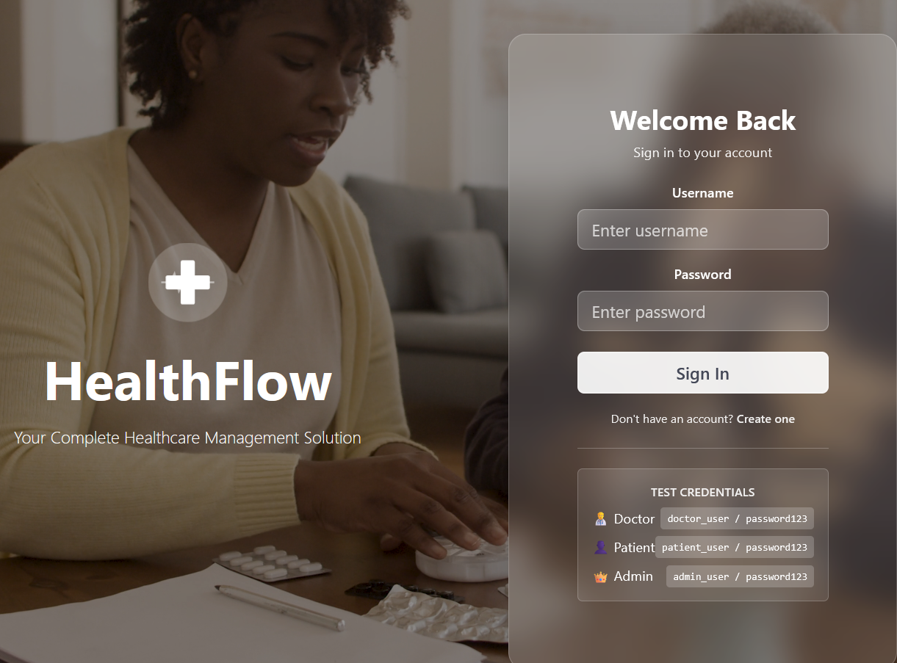
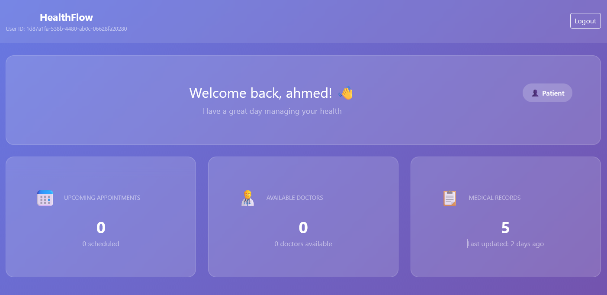
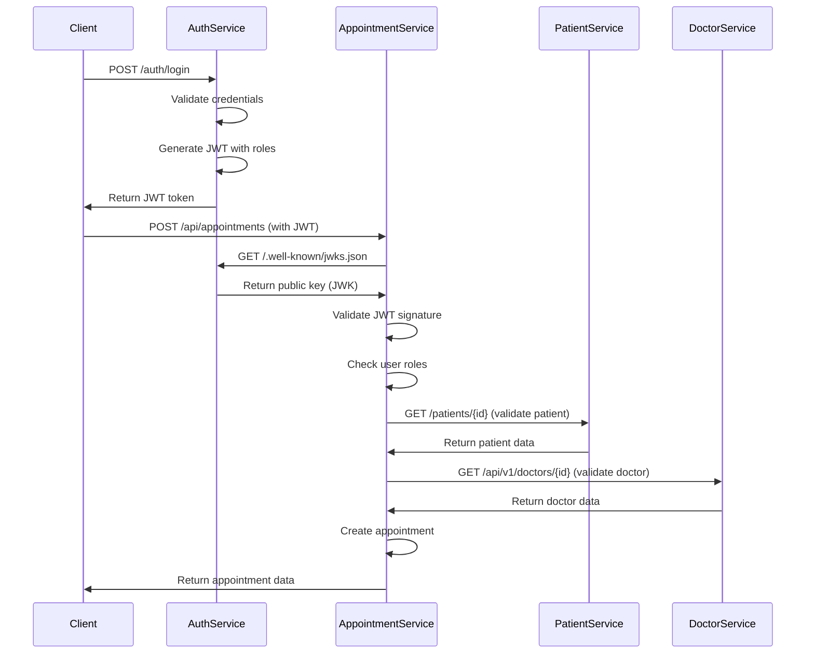
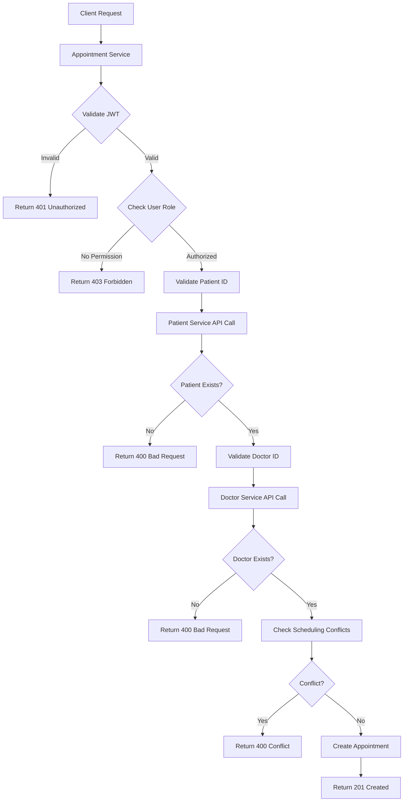
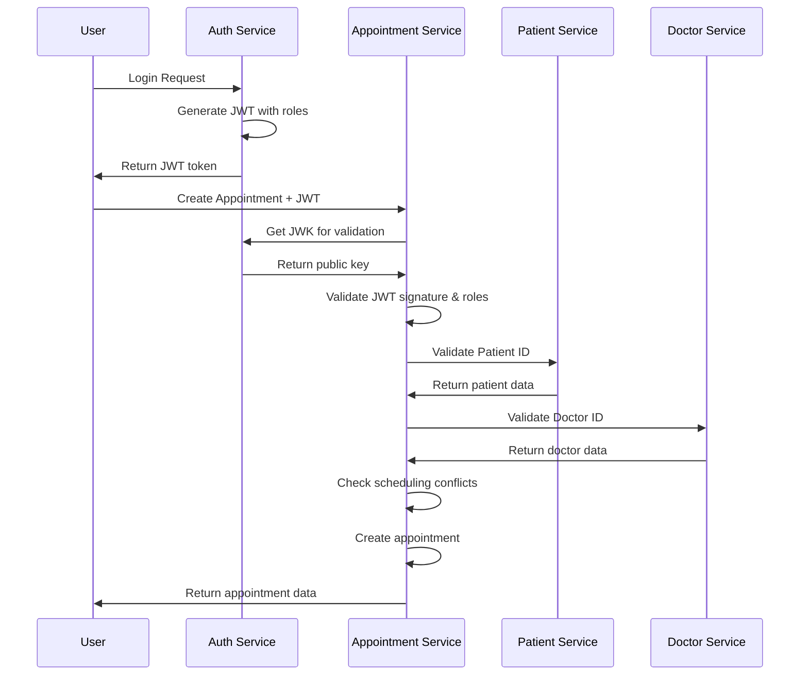

# Healthcare Management System - Microservices Architecture

A comprehensive healthcare management system built with Spring Boot microservices, featuring JWT authentication, role-based authorization, and service-to-service communication.

## Screenshot



## 🏗️ Architecture Overview

### Microservices Structure
```
┌─────────────────┐    ┌─────────────────┐    ┌─────────────────┐
│   Auth Service  │    │ Patient Service │    │ Doctor Service  │
│   Port: 4002    │    │   Port: 4000    │    │   Port: 4001    │
│                 │    │                 │    │                 │
│ • JWT Generation│    │ • Patient CRUD  │    │ • Doctor CRUD   │
│ • JWK Endpoint  │    │ • Medical Records│   │ • Specializations│
│ • User Auth     │    │ • Allergies     │    │ • Availability  │
└─────────────────┘    └─────────────────┘    └─────────────────┘
         │                       │                       │
         │                       │                       │
         └───────────────────────┼───────────────────────┘
                                 │
                    ┌─────────────────┐
                    │Appointment Service│
                    │   Port: 4003    │
                    │                 │
                    │ • Appointment CRUD│
                    │ • Scheduling     │
                    │ • Validation     │
                    └─────────────────┘
```

## 🔐 Authentication & Authorization Flow

### JWT Authentication Process


## 🛡️ Security Architecture

### JWT Token Structure
```json
{
  "header": {
    "alg": "RS256",
    "typ": "JWT",
    "kid": "auth-service-key"
  },
  "payload": {
    "sub": "doctor_user",
    "roles": ["DOCTOR"],
    "iss": "http://localhost:4002/auth",
    "exp": 1704067200,
    "iat": 1704063600
  },
  "signature": "RSA-SHA256 signature..."
}
```

### JWK (JSON Web Key) Endpoint
```json
{
  "keys": [
    {
      "kty": "RSA",
      "use": "sig",
      "kid": "auth-service-key",
      "alg": "RS256",
      "n": "modulus...",
      "e": "AQAB"
    }
  ]
}
```

## 🔄 Service Communication Flow

### Appointment Creation with Validation


## 📊 API Endpoints Overview

### Authentication Service (Port 4002)
```
POST /auth/login              - User login
POST /auth/register           - User registration
GET  /.well-known/jwks.json  - Public key for JWT validation
```

### Patient Service (Port 4000)
```
GET    /patients              - List all patients (DOCTOR, ADMIN)
POST   /patients              - Create patient (DOCTOR, ADMIN)
GET    /patients/{id}         - Get patient by ID (DOCTOR, ADMIN)
PUT    /patients/{id}         - Update patient (DOCTOR, ADMIN)
DELETE /patients/{id}         - Delete patient (ADMIN)
GET    /patients/health       - Health check
```

### Doctor Service (Port 4001)
```
GET    /api/v1/doctors        - List all doctors (All roles)
POST   /api/v1/doctors        - Create doctor (ADMIN)
GET    /api/v1/doctors/{id}   - Get doctor by ID (All roles)
PUT    /api/v1/doctors/{id}   - Update doctor (ADMIN)
DELETE /api/v1/doctors/{id}   - Delete doctor (ADMIN)
GET    /api/v1/doctors/health - Health check
```

### Appointment Service (Port 4003)
```
GET    /api/appointments              - List appointments (DOCTOR, ADMIN)
POST   /api/appointments              - Create appointment (DOCTOR, ADMIN)
GET    /api/appointments/{id}         - Get appointment by ID (DOCTOR, ADMIN)
PUT    /api/appointments/{id}         - Update appointment (DOCTOR, ADMIN)
DELETE /api/appointments/{id}         - Delete appointment (DOCTOR, ADMIN)
GET    /api/appointments/patient/{id} - Get patient appointments (All roles)
GET    /api/appointments/doctor/{id}  - Get doctor appointments (DOCTOR, ADMIN)
GET    /api/appointments/health       - Health check
```

## 🔧 Technology Stack

### Backend
- **Spring Boot 3.x** - Main framework
- **Spring Security** - Authentication & authorization
- **Spring Data JPA** - Data persistence
- **H2 Database** - In-memory database (development)
- **JWT (JJWT)** - Token-based authentication
- **RestClient** - Service-to-service communication
- **Maven** - Dependency management
- **Redis** - Caching (optional, currently disabled)

### Security
- **JWT (RS256)** - Asymmetric encryption
- **JWK** - Public key distribution
- **OAuth2 Resource Server** - JWT validation
- **Role-Based Access Control** - Authorization

## 📚 Documentation

- **[Quick Start Guide](docs/quick-start.md)** - Get up and running in 5 minutes
- **[API Documentation](docs/api-documentation.md)** - Complete API reference
- **[Development Guide](docs/development-guide.md)** - Developer handbook
- **[Architecture Diagrams](docs/architecture-diagram.md)** - System architecture
- **[Configuration Guide](docs/configuration-guide.md)** - Enable/disable features
- **[Project Summary](docs/project-summary.md)** - Project overview

## 🚀 Getting Started

### Prerequisites
- Java 17+
- Maven 3.6+
- IDE (IntelliJ IDEA, Eclipse, VS Code)
- Redis (Optional - currently disabled for testing)

### Running the Services

1. **Clone the repository**
   ```bash
   git clone <repository-url>
   cd microservices-project
   ```

2. **Start all services** (in separate terminals)
   ```bash
   # Terminal 1 - Auth Service
   cd auth-service
   mvn spring-boot:run

   # Terminal 2 - Patient Service
   cd patient-service
   mvn spring-boot:run

   # Terminal 3 - Doctor Service
   cd doctor-service
   mvn spring-boot:run

   # Terminal 4 - Appointment Service
   cd appointment-service
   mvn spring-boot:run
   ```

3. **Verify services are running**
   ```bash
   curl http://localhost:4000/patients/health
   curl http://localhost:4001/api/v1/doctors/health
   curl http://localhost:4002/auth/.well-known/jwks.json
   curl http://localhost:4003/api/appointments/health
   ```

## 🧪 Testing the System

### 1. Authentication Test
```bash
# Login as doctor
curl -X POST http://localhost:4002/auth/login \
  -H "Content-Type: application/json" \
  -d '{"username": "doctor_user", "password": "password123"}'

# Save the JWT token from response
```

### 2. Service Communication Test
```bash
# Create appointment (with JWT token)
curl -X POST http://localhost:4003/api/appointments \
  -H "Content-Type: application/json" \
  -H "Authorization: Bearer YOUR_JWT_TOKEN" \
  -d '{
    "patientId": 1,
    "doctorId": 1,
    "appointmentDateTime": "2025-01-15T10:00:00",
    "durationMinutes": 30,
    "type": "CONSULTATION",
    "status": "SCHEDULED",
    "notes": "Test appointment"
  }'
```

### 3. Test Files
Use the provided HTTP test files in `api-requests/` directory:
- `comprehensive-jwt-test.http` - Complete workflow test
- `service-communication-test.http` - Service validation test
- `role-based-authorization-test.http` - Authorization test

## 🔒 Security Features

### JWT Token Validation
1. **Token Structure**: RS256 algorithm with RSA key pair
2. **Claims Validation**: Issuer, expiration, roles
3. **Public Key**: Distributed via JWK endpoint
4. **Stateless**: No server-side session storage

### Role-Based Authorization
- **PATIENT**: Can view own appointments
- **DOCTOR**: Can manage appointments and patients
- **ADMIN**: Full system access

### Service-to-Service Security
- **JWT Propagation**: Services validate tokens independently
- **API Validation**: Patient/Doctor existence checked before operations
- **Error Handling**: Graceful failure with meaningful messages

## 📈 Data Flow

### Complete Appointment Creation Flow


## 🛠️ Development Workflow

### Adding New Features
1. **Design API endpoints** - Follow RESTful principles
2. **Implement security** - Add JWT validation and role checks
3. **Add service communication** - Validate dependencies
4. **Write tests** - Create HTTP test files
5. **Update documentation** - Keep README current

### Code Structure
```
microservices-project/
├── auth-service/           # Authentication & JWT
├── patient-service/        # Patient management
├── doctor-service/         # Doctor management
├── appointment-service/    # Appointment scheduling
├── api-requests/          # HTTP test files
└── README.md              # This file
```

## 🔮 Future Enhancements

### Planned Features
- **Frontend Dashboard** - React/Vue.js web interface
- **Real-time Notifications** - WebSocket for live updates
- **Prescription Management** - Medication tracking
- **Medical Records** - Comprehensive patient history
- **Live Chat** - Doctor-patient communication
- **File Upload** - Medical documents and images

### Infrastructure Improvements
- **API Gateway** - Spring Cloud Gateway
- **Service Discovery** - Eureka/Consul
- **Load Balancing** - Multiple service instances
- **Database** - PostgreSQL for production
- **Caching** - Redis for performance
- **Monitoring** - Prometheus + Grafana
- **Containerization** - Docker + Kubernetes

## 📝 API Documentation

### Request/Response Examples

#### Login Request
```json
POST /auth/login
{
  "username": "doctor_user",
  "password": "password123"
}
```

#### Login Response
```json
{
  "token": "eyJhbGciOiJSUzI1NiIsInR5cCI6IkpXVCJ9...",
  "type": "Bearer",
  "expiresIn": 3600
}
```

#### Create Appointment Request
```json
POST /api/appointments
{
  "patientId": 1,
  "doctorId": 1,
  "appointmentDateTime": "2025-01-15T10:00:00",
  "durationMinutes": 30,
  "type": "CONSULTATION",
  "status": "SCHEDULED",
  "notes": "Initial consultation"
}
```

## 🤝 Contributing

1. Fork the repository
2. Create a feature branch
3. Make your changes
4. Add tests
5. Submit a pull request

## 📄 License

This project is licensed under the MIT License - see the LICENSE file for details.

---

**Built with ❤️ using Spring Boot Microservices Architecture**
